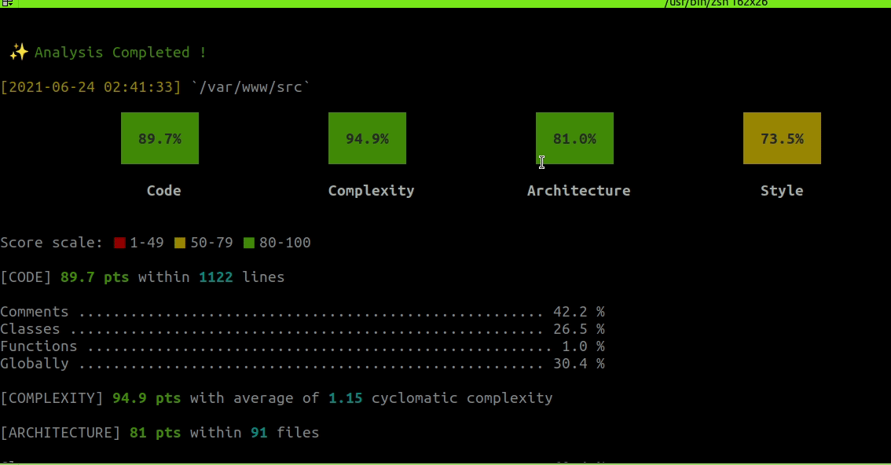

<p align="center"><a href="https://laravel.com" target="_blank"></a></p>

# Docker + PHP Laravel + PHPunit + Tooling 
___________



Project developed during the "backend" phase at FIAP College.

## Usage

Started environment:

```bash
docker-composer up -d --build
```
## [PHPinsights](https://phpinsights.com/insights/code.html#forbidden-functions)

Analysis of code quality and coding style. Beautiful overview of code architecture and it's complexity
You can run inside container.

```bash
docker exect -it transfer-app bash 
```
Run command:
```bash
cd src/ && ./vendor/bin/phpinsights
```

